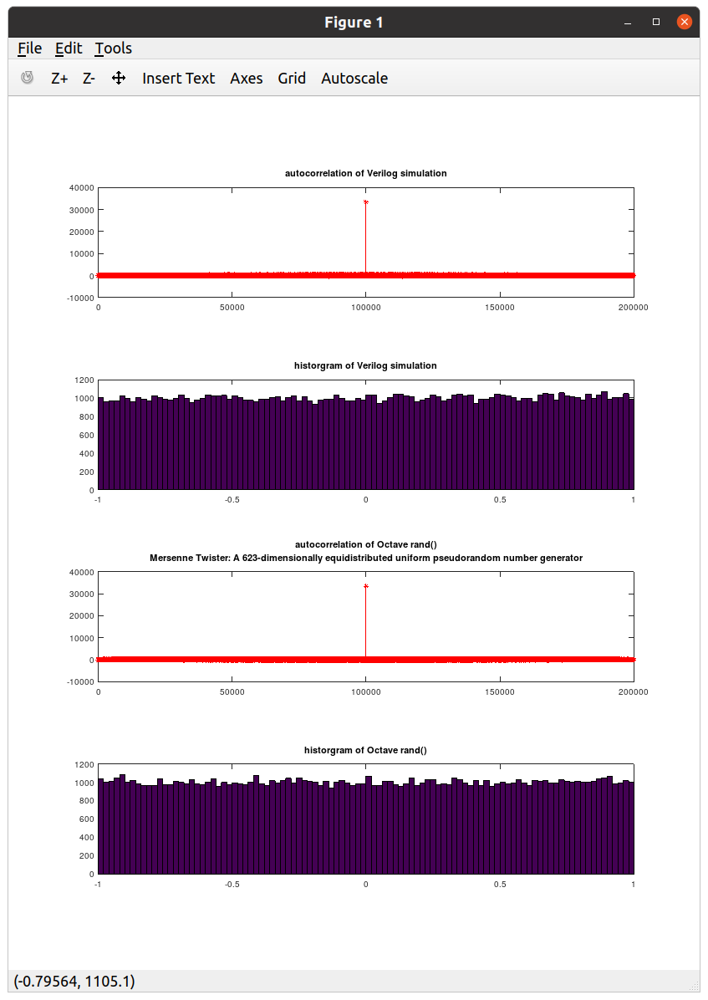

# pg_prng
This is a very light weight fpga pseudorandom number generator.

This pseudorandom number generator is designed to be efficient and fast when implemented in fpga logic.

A simulation test bench is provided which saves the sequence to a file.  Then an Octave .m file is used to compare the performance with the rand() function.

Below you can see this design compared to the Mersenne Twister used in the random() function of Gnu Octave. This extremely simple design seems to perform equally well.

